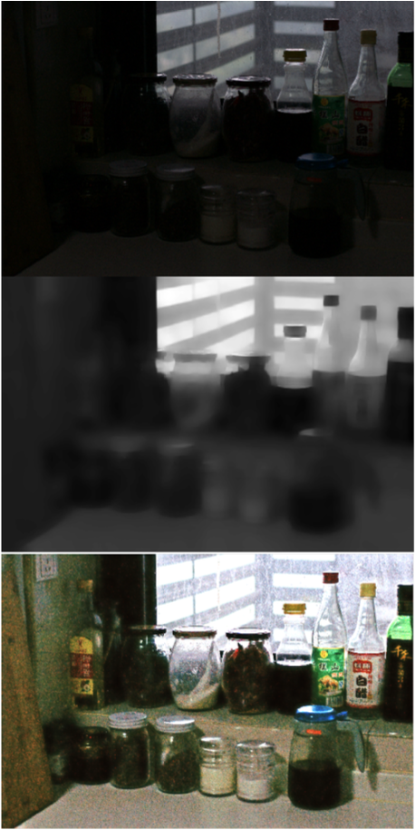
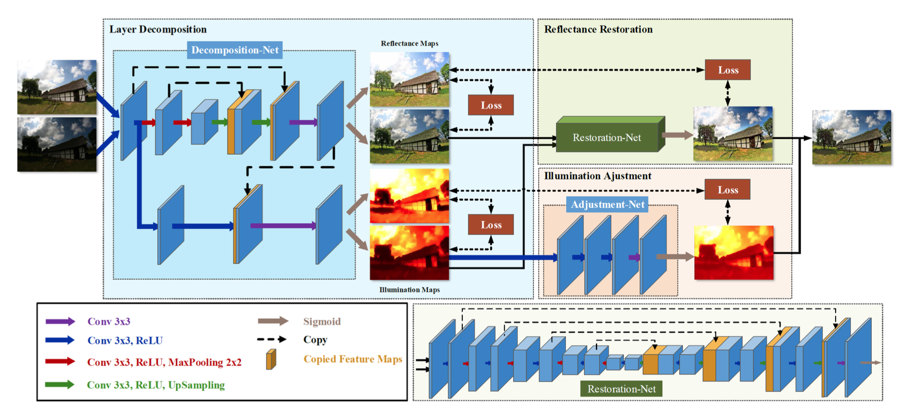
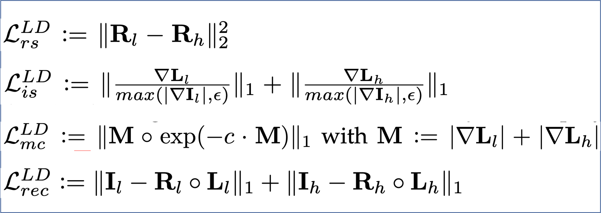
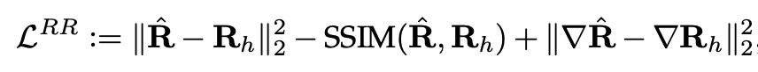
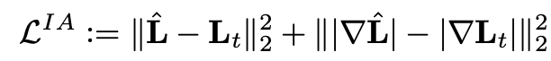
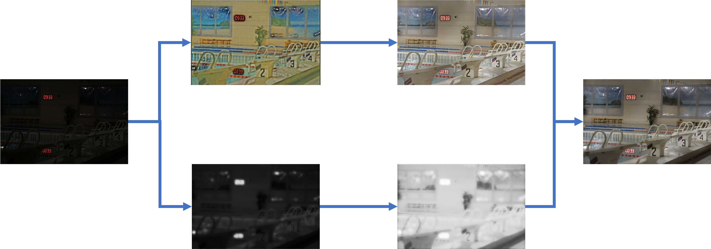

# Method
In this project, we adopt KinD algorithm proposed by Zhang et al. [5] to build a low-light image emhancer. It is a CNN-based approach and the original implementation is on TensorFlow. We re-implement the algorithm by using Pytorch and do the experiment on LOLdataset [6]. In this section, we will introduce the network, training scheme, and inference procedure.

## Background: Retinex Theory
Since the method is based on retinex theory, which was proposed by Edwin H. Land in 1963 and has been applied to many image enhancement applications, we briefly introduce retinex theory here. Retinex theory indicates that an image is a composition of two components, illumination map and reflectance map. The illumination map models the strength of incident light while the reflectance map represents that reflection property of object surface. Figure 3.1 is an example of decomposing an image into illumination map and reflectance map. Since illumination map is the strength of incident light, it looks piece-wise smooth. As for reflectance map, it shows the detail and the texture of objects. Also, noise is on the reflectance map.

The intuition of using retinex theory on low-light image enhancement is that if getting illumination map and reflectance map with high quality, it would be easy to raise the brightness of image without amplifying noise. Besides, noise is extracted on reflectance map, so noise reduction is also easier.

||
|:--:|
| Figure 3.1. Example of illumination map and reflectance map [5] |

## KinD Network Architecture
KinD is a CNN-based method which first decomposes input image into illumination map and reflectance map by a layer decomposition net. Then, for two maps, it further use two separate networks to complete different tasks. For reflectance map, it uses reflectance restoration net to reduce the degradation. For illumination map, it uses illumination adjustment net to modify the brightness level of illumination net. After two maps are processed, enhanced output can be simply generated by doing element-wise prodcut between reflectance map and illumination map. Figure 3.2 shows the overall architecture.

||
|:--:|
| Figure 3.2. Architecture of KinD algorithm [5] |

Since there is no ground truth reflectance and illumination, the network is trained by paired high-light and low-light images. Specifically, it use high-light image to guide low-light image.

## Layer Decomposition Net
Layer decomposition net is the first phase of the algorithm. Its task is to learn the decomposition of retinex theory. Its inputs are a high-light image and a low-light image and its outputs are reflectance map and illumination map of high-light image and those of low-light image.

There are two branches in this network. One branch is for generating reflectance map and the other is for generating illumination map. The architecture of reflectance branch is U-Net [4] and that of illumination branch is simply 3 convolutional layers. Also, last layer of reflectance branch is passed to illumination branch for excluding texture on illumination map.

Figure 3.3 shows loss functions used in layer decomposition net. The first one wants reflectance map of high light and that of low light to be close since the scene is the same. The second one makes illumination becomes piece-wise smooth. The third one wants to preserve strong edges in both illumination maps while depress weak edges. The last one wants the reconstruction to be close to input.

||
|:--:|
| Figure 3.3. Loss functions of layer decomposition net [5] |

In our implement, the weight for these loss functions are 0.009, 0.005, 0.2, and 1.

## Reflectance Restoration Net
Reflectance Restoration net uses high-light reflectance map as target since it has less noise and defect. It tries to align low-light reflectance map to high-light reflectance map to remove noise and degradation. The loss functions for this goal are square l2-norm between reflectance maps of high-light and output, SSIM between reflectance maps of high-light and output, and square l2-norm between gradient of reflectance maps of high-light and output, like figure 3.4 shows.

||
|:--:|
| Figure 3.4. Loss functions of reflectance restoration net [5] |

The input of reflectance restoration net also contains illumination map because strength of degradation depends on illumination. Thus, it is helpful to include illumination map in input.

## Illumination Adjustment Net
Illumination adjustment net's input is a 
illumination map concatenated with a ratio map. Its goal is to adjust the illumination map by that ratio. During training, it randomly choose high-light or low-light illumination as input and the other as target. Then, the ratio will be average brightness of input illumination over that of target illumination. It further use squre l2-norm between target and output to constraint the training, which is shown in figure 3.5.

||
|:--:|
| Figure 3.5. Loss functions of illumination adjustment net [5] |

During inference, user can set ratio to arbitrary value to indicate the amount of adjustment. We also show effects of different ratios in the evaluation section.

## Training
As for training, layer decomposition net is trained first. With the trained layer decomposition net, reflectance restoration net and illumination adjustment net can be trainined paralleled.

For layer decomposition net, we train it with randomly cropped 48x48 patch and use 400 epoches. For reflectance restoration net, randomly cropped patch is 128x128 and epoches is 1000. Finally, for illumination adjustment net, patch is 48x48 and epoches is 2000. All of them also include data augmentation like random flip and rotation and are trained with Adam optimizer.

## Inference

Figure 3.6 show the inference with real data. The ratio in this example is set to 5.

||
|:--:|
| Figure 3.6. Inference flow with real data |

