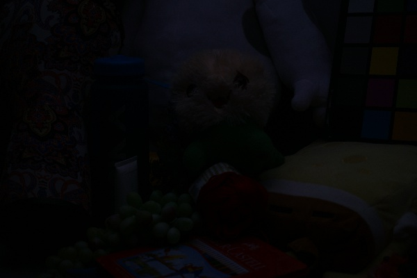
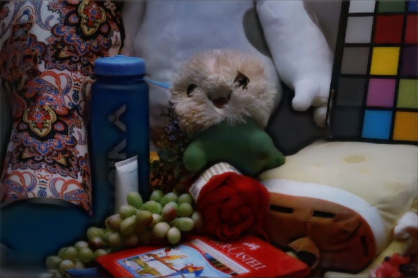

# Evaluation
import useBaseUrl from '@docusaurus/useBaseUrl';

Our goal is to achieve the result presented in Kindling the Darkness: A Practical Low-light Image Enhancer[5] from Zhang et al. For example, given the input(left image), the paper's model could generate the corresponding result shown as the right image.

We evaluated the results by objective and subjective methods. For the objective evaluations, we computed PSNR and SSIM. They are commonly used metrics for image quality. PSNR is the peak-signal-to-noise ratio. Higher PSNR indicates that result images are closer to the ground truths. SSIM is structural similarity index measure, which shows the similarity between structures of two images. Higher SSIM is better. Although these two objective metrics are popular, they can’t reflect the visual perception of humans. Therefore, we also compared input images, ground truths, and output images by simply using our eyes. By placing those images side-by-side, we can tell whether there are any artifacts, like color inconsistency or over-enhancement on output images. We also added extra functionality for adjusting ratio for illumination and evaluation performance using PSNR and SSIM.

## Objective Evaluations
* PSNR: Peak signal to noise ratio is an engineering expression term for the ratio between the maximum possible value (power) of a signal and the power of corrupting/distorting noise that affects the fidelity of its representation. Because many signals have a very wide *dynamic range*, PSNR is usually expressed as a logarithmic quantity using the decibel scale.
* SSIM: structural similarity index is a perceptual metric that quantifies image quality degradation caused by processing such as data compression or by losses in data transmission.

### Quantitative Results
We used PSNR and SSIM with high light image as target.
|  | PSNR | SSIM |
| :-----------:  | :-----------:  | :-----------:  |
| without enhancement  | 7.77  | 0.1952  |
| with enhancement  | 18.5  | 0.8016  |

## Subjective Evaluations
The evaluation showed that a higher ratio might get better results and with enhancement implementation, we could get higher PSNR and SSIM which represented better performance.
### Result of Different Ratio
| Input | Ratio = 2 | Ratio = 3 | Ratio = 4 | Ratio = 5 |
| :-----------:  | :-----------:  | :-----------:  | :-----------: | :-----------:  |
|   |   |   |  |   |
|   |   |   |  |   |
|   |   |   |  |   |

### Artifacts
Evaluation results contained artifacts that showed slightly different colors and halos.

### Same Model with Our Photos
Camera model: Image captured by Iphone X
Ratio: 5.0
| Input | Decompostion Result | Illumination Result | Restoration Result | Final Result |
| :-----------:  | :-----------:  | :-----------:  | :-----------: | :-----------:  |
|   |   |   |  |   |
