# Evaluation
import useBaseUrl from '@docusaurus/useBaseUrl';

Our goal is to achieve the result presented in *Kindling the Darkness: A Practical Low-light Image Enhancer* [5] from Zhang et al. For example, given the input(left image), the paper's model could generate the corresponding result shown as the right image.

We evaluated the results by objective and subjective methods. For the objective evaluations, we adopt PSNR and SSIM. They are commonly used metrics for image quality. PSNR is the *peak-signal-to-noise ratio*. Higher PSNR indicates that result images are closer to the ground truths. SSIM is *structural similarity index* measure, which shows the similarity between structures of two images. Higher SSIM is better.

Although these two objective metrics are popular, they can’t reflect the visual perception of humans. Therefore, we also compare results by simply using our eyes. By placing inputs and results side-by-side, we can tell whether there are any artifacts on output images. 

Finally, we send images out of dataset to the model to see whehter the model is possible to generlize.

## Objective Evaluations
* **PSNR**: Peak signal to noise ratio is an engineering expression term for the ratio between the maximum possible value (power) of a signal and the power of corrupting/distorting noise that affects the fidelity of its representation. Because many signals have a very wide dynamic range, PSNR is usually expressed as a logarithmic quantity using the decibel scale.
* **SSIM**: structural similarity index is a perceptual metric that quantifies image quality degradation caused by processing such as data compression or by losses in data transmission.

### Quantitative Results
When computing PSNR and SSIM, we use high-light image as target.

|  | PSNR | SSIM |
| :-----------:  | :-----------:  | :-----------:  |
| without enhancement  | 7.77  | 0.1952  |
| with enhancement  | 18.5  | 0.8016  |

## Subjective Evaluations

### Result of Different Ratio
KinD allows user to indicate enhancement level by a ratio and we evaluate on different ratio value to see how it works. The higher ratio lead to brigter and more clear results which are visually pleasant. Although the change seems not linear, having a control over the output is still a good property for deep learning method.

| Input | Ratio = 2 | Ratio = 3 | Ratio = 4 | Ratio = 5 |
| :-----------:  | :-----------:  | :-----------:  | :-----------: | :-----------:  |
| 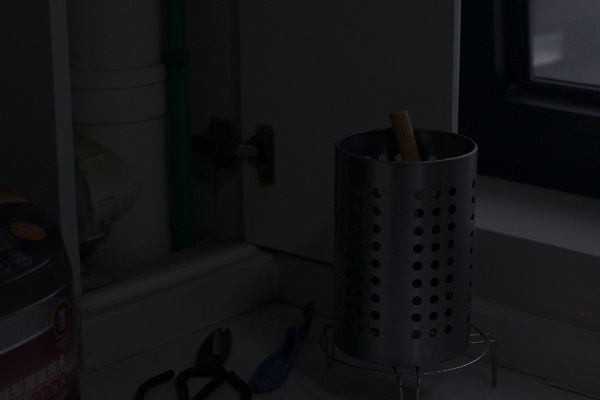  | 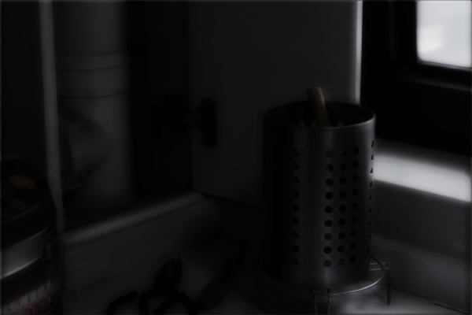  | 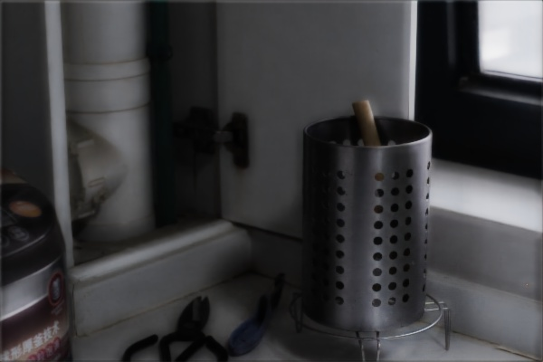  | 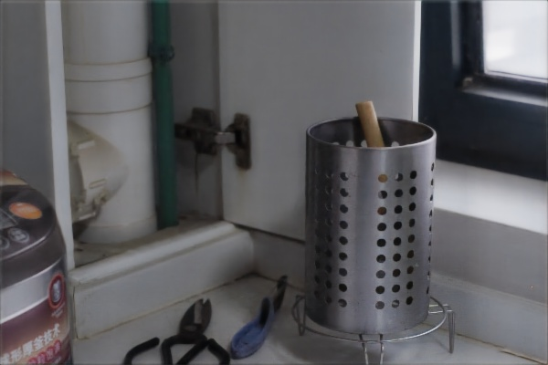 | 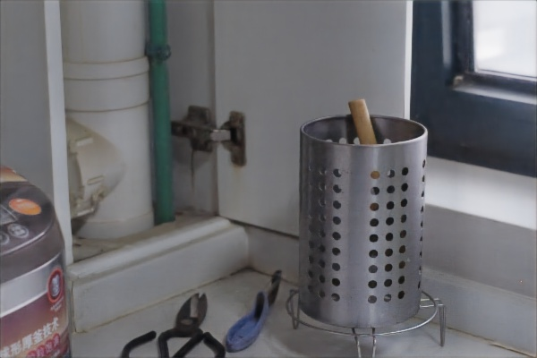  |
| 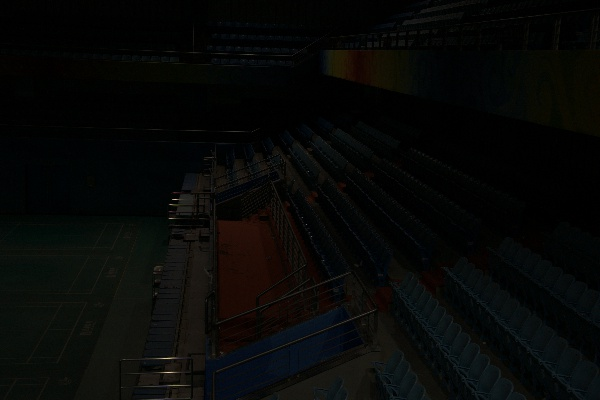  | 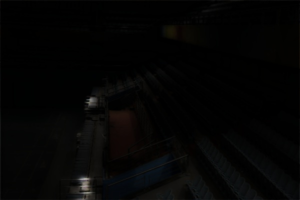  | 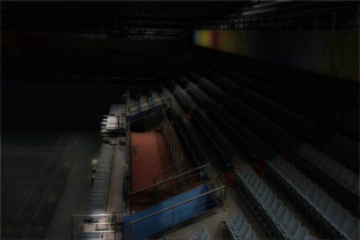  | 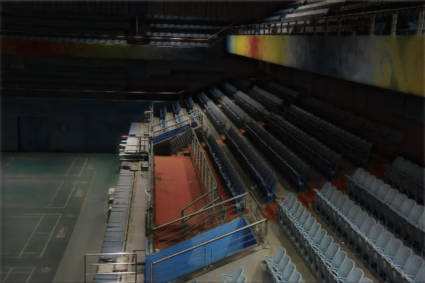 | 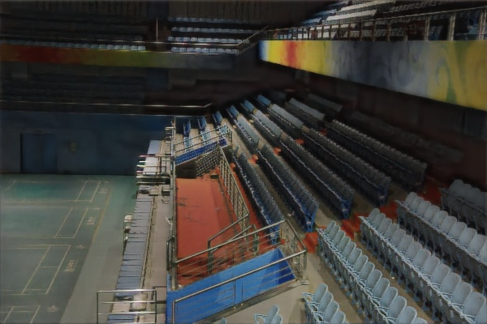  |
| 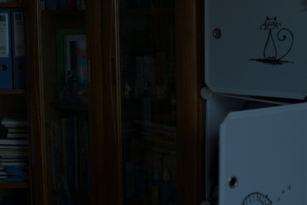  | 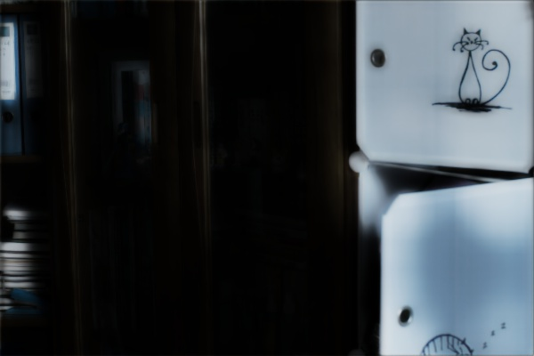  | 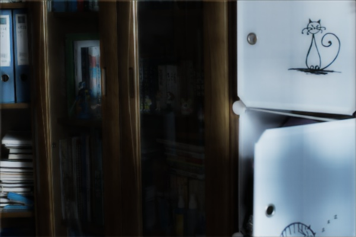  | 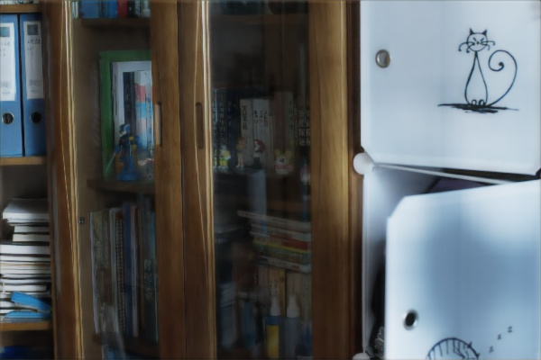 | 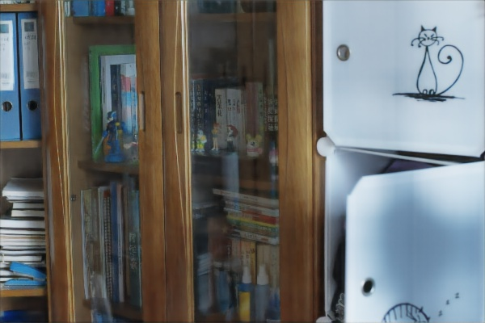  |

### Artifacts
The method is not perfect, we find it introduces artifacts like halo and color inconsistency.

&nbsp;

### Generalization
We try passing photos captured by Iphone X to the model trained on LOLDatset. With the ratio being set to 5, the result shows that the model cannot be generlized. We think the reason is different camera module has differne noise behavior, so re-training is needed for different camera.

| Decompostion Result | Illumination Result | Restoration Result |
| :-----------:  | :-----------:  | :-----------: |
| 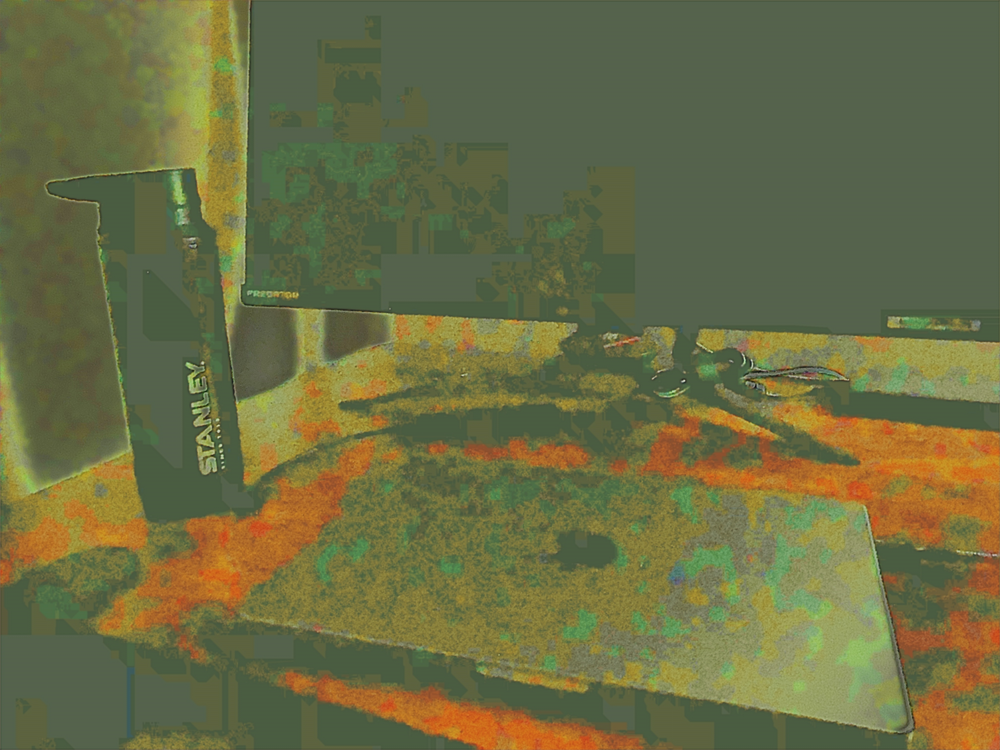  | 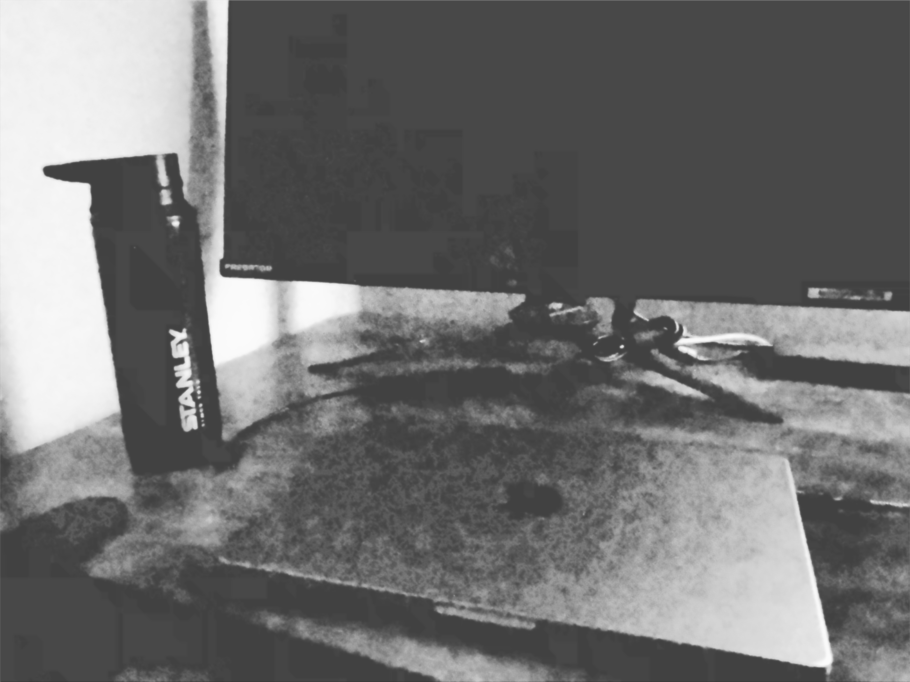  | 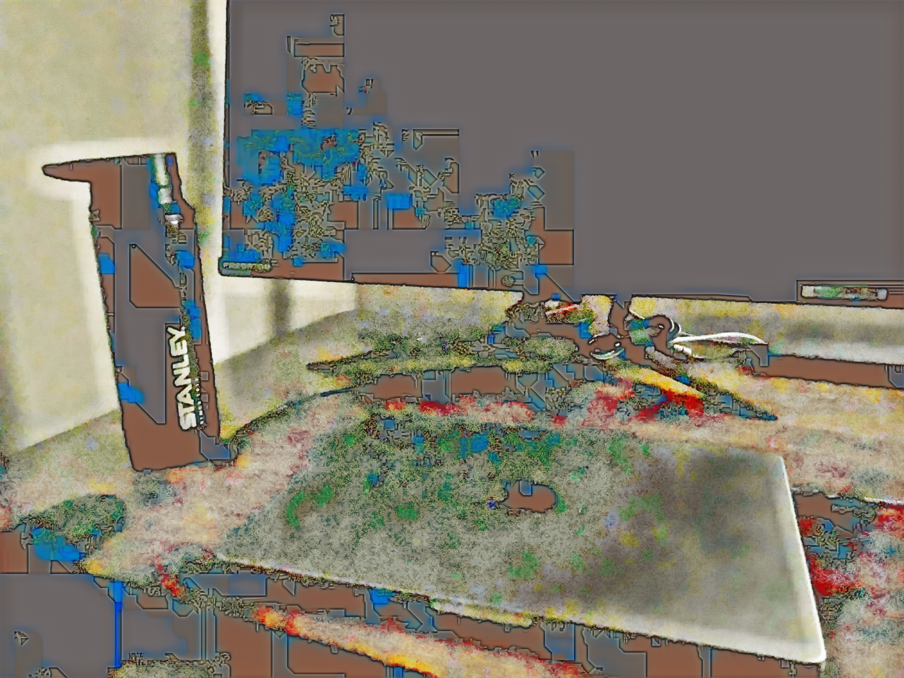 |

| Input | Output |
| :-----------:  | :-----------:  |
| 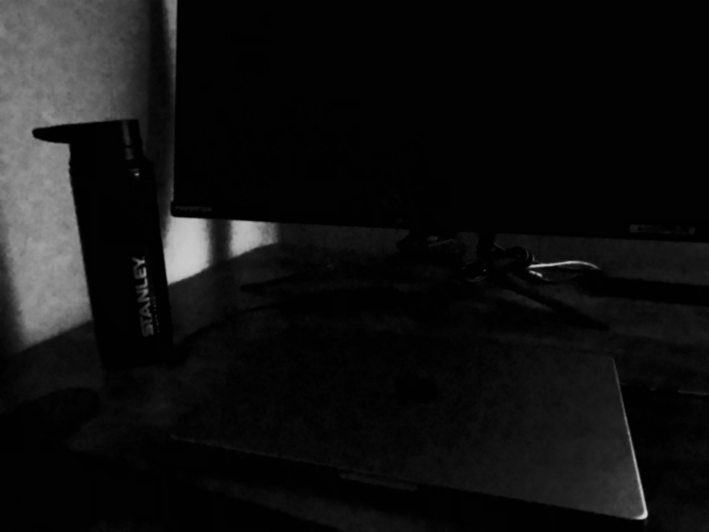  | 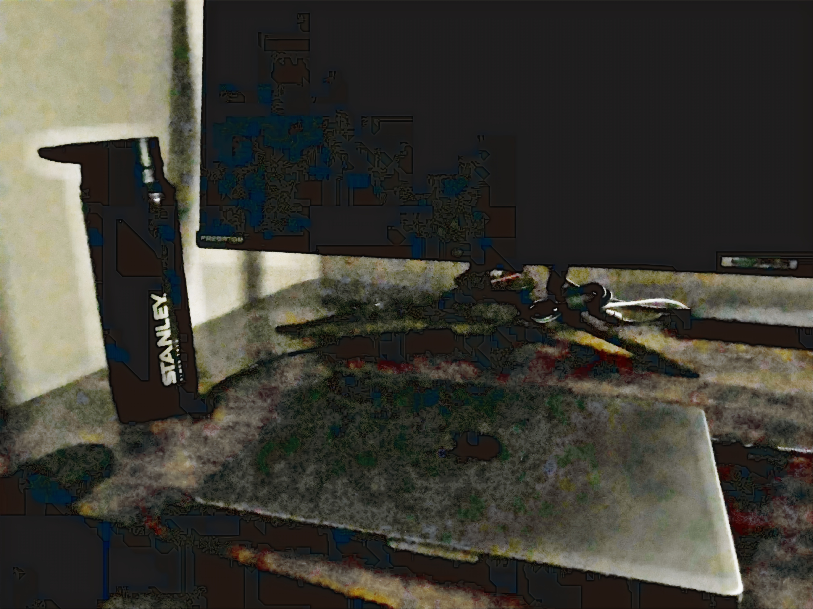  |
